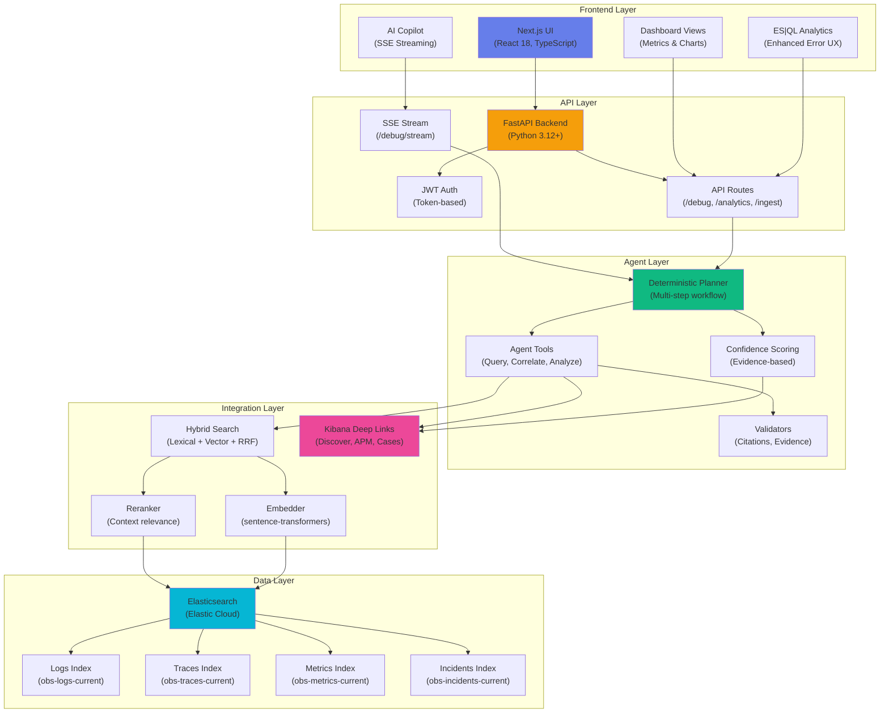
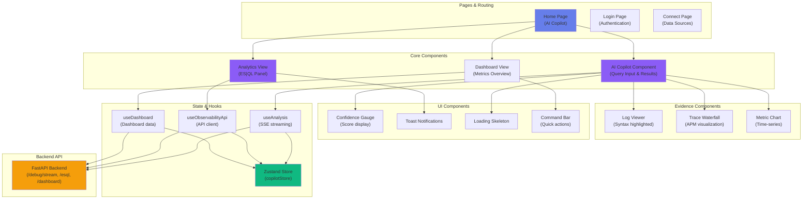
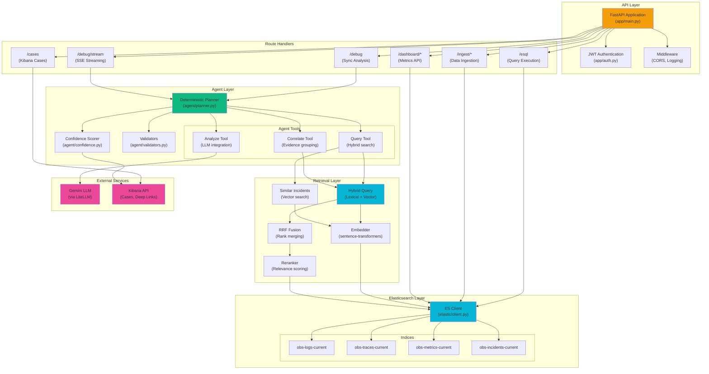

# Agentic Observability Copilot

An AI-powered observability assistant that correlates logs, traces, and metrics, retrieves similar past incidents, and proposes root causes and remediations with evidence links to Kibana/APM.

---

## Architecture



### Architecture Principles

- **Hybrid Retrieval**: Combines lexical + vector search with RRF (Reciprocal Rank Fusion) for optimal evidence discovery
- **Deterministic Agent Workflow**: Scope → Gather Signals → Correlate → Similar Incidents → Root Cause → Remediations
- **Evidence-Based Confidence**: Every finding has a confidence score based on trace/log alignment, similar incidents, and evidence count
- **Kibana Deep Links**: Direct links to Discover, APM traces, and Metrics dashboards for every finding
- **Real-time Streaming**: Server-Sent Events (SSE) for live analysis updates to the frontend

---

## Frontend Architecture

### Technology Stack

- **Framework**: Next.js 15 (App Router)
- **Language**: TypeScript
- **Styling**: Tailwind CSS
- **State Management**: Zustand
- **API Communication**: Fetch API with SSE streaming
- **Charts**: Recharts (for analytics visualizations)

### Frontend Architecture Diagram



### Key Components

#### 1. **AI Copilot** (`app/page.tsx`)

- Real-time query input with autocomplete
- SSE streaming for live analysis updates
- Results display with confidence gauge
- Evidence viewer (logs, traces, metrics)
- Tabbed interface (Summary, Evidence, Timeline, Actions)

#### 2. **Analytics Dashboard** (`app/components/analytics/`)

- **ES|QL Query Panel**: Interactive Elasticsearch Query Language editor
  - Syntax highlighting
  - Enhanced error messages with helpful tips
  - Query examples and templates
  - Results table with sorting and filtering
  - Null value visibility improvements
- **Dashboards**: Kibana dashboard embedding and iframe integration
- **AI Assistant**: Natural language data exploration with critic analysis

#### 3. **Evidence Viewers** (`app/components/evidence/`)

- **LogViewer**: Syntax-highlighted log viewer with filtering
- **TraceWaterfall**: APM trace visualization with span details
- **MetricChart**: Time-series charts for metrics correlation

#### 4. **Dashboard View** (`app/components/views/DashboardView.tsx`)

- Service health overview
- Recent incidents timeline
- Top errors and performance metrics
- Quick actions panel

### Frontend Features

✅ **Real-time Analysis**: SSE streaming shows live progress  
✅ **Enhanced Error UX**: Context-aware tips for ES|QL query errors  
✅ **Responsive Design**: Works on desktop and tablet  
✅ **Dark Mode**: Modern dark theme with high contrast  
✅ **Evidence Links**: Click to open in Kibana/APM  
✅ **Confidence Visualization**: Circular gauge with color coding  
✅ **Error Boundaries**: Graceful error recovery without full-page crashes  
✅ **localStorage Persistence**: Run history (50 max) and saved prompts survive refresh  
✅ **My Cases View**: Browse all Kibana Cases from the Actions tab  
✅ **Clear History**: One-click purge of run history from the History panel  
✅ **17 Help Flows**: In-app guided workflows for every user action  

### Frontend File Structure

```plaintext
frontend/
├── app/
│   ├── components/
│   │   ├── analytics/
│   │   │   ├── AnalyticsView.tsx        # Main analytics page
│   │   │   ├── ESQLQueryPanel.tsx       # ES|QL editor (enhanced)
│   │   │   ├── KibanaDashboard.tsx      # Kibana iframe embed
│   │   │   └── AIDataExplorer.tsx       # NL data explorer
│   │   ├── evidence/
│   │   │   ├── LogViewer.tsx            # Log display
│   │   │   ├── TraceWaterfall.tsx       # Trace visualization
│   │   │   └── MetricChart.tsx          # Metrics charts
│   │   ├── views/
│   │   │   ├── DashboardView.tsx        # Dashboard overview
│   │   │   ├── ResultsView.tsx          # Analysis results
│   │   │   ├── MyCasesView.tsx          # Kibana Cases browser
│   │   │   └── CommandBar.tsx           # Quick actions
│   │   ├── remediation/
│   │   │   └── RemediationSafetyGate.tsx # Fix approval UX
│   │   ├── ConfidenceGauge.tsx          # Confidence display
│   │   ├── ErrorBoundary.tsx            # React error boundaries
│   │   ├── LoadingSkeleton.tsx          # Loading states
│   │   ├── HelpPanel.tsx               # 17 guided workflows
│   │   └── Toast.tsx                    # Notifications
│   ├── hooks/
│   │   ├── useAnalysis.ts               # SSE streaming hook
│   │   ├── useObservabilityApi.ts       # API client
│   │   ├── useCaseManagement.ts         # Kibana case creation
│   │   └── useDashboard.ts              # Dashboard data
│   ├── store/
│   │   └── copilotStore.ts              # Zustand state (localStorage)
│   ├── page.tsx                         # Home (AI Copilot)
│   └── login/page.tsx                   # Authentication
├── __tests__/
│   └── e2e/                              # Playwright E2E tests
│       ├── auth.setup.ts                 # Auth token setup
│       ├── 02_run_analysis.spec.ts       # AI analysis flow
│       ├── 03_esql_query.spec.ts         # ES|QL execution
│       ├── 04_analytics_toggle.spec.ts   # View switching
│       ├── 05_history_panel.spec.ts      # History panel
│       └── 06_kibana_case.spec.ts        # Case creation
├── playwright.config.ts                  # Playwright config
└── public/                               # Static assets
```

---

## Backend Architecture

### Backend Technology Stack

- **Framework**: FastAPI 0.100+
- **Language**: Python 3.12+
- **Database**: Elasticsearch (Elastic Cloud)
- **Embeddings**: sentence-transformers
- **LLM**: Gemini (via LiteLLM)
- **Authentication**: JWT tokens

### Backend Architecture Diagram



### API Routes

#### Core Endpoints

##### **POST `/debug`** - Synchronous Analysis

```json
{
  "question": "Why is checkout slow?",
  "service": "payment-api",
  "environment": "production",
  "time_range": ["now-1h", "now"]
}
```

Returns complete analysis with findings, root causes, and remediations.

##### **POST `/debug/stream`** - Streaming Analysis (SSE)

Same request format, but streams events:

- `event: stage` - Current analysis stage (index 0-5)
- `event: progress` - Status message updates
- `event: result` - Final analysis result
- `event: error` - Error occurred

##### **POST `/esql`** - ES|QL Query Execution

```json
{
  "query": "FROM obs-logs-current | WHERE level == \"error\" | STATS count() BY service"
}
```

Returns query results or enhanced error messages.

##### **POST `/ingest/logs`** - Log Ingestion

Bulk ingest logs into Elasticsearch with enrichment and embedding.

##### **POST `/ingest/incident`** - Incident Storage

Store resolved incidents for similarity search.

#### Other Endpoints

- **GET `/dashboard/metrics`** - Service health metrics
- **GET `/cases`** - List Kibana cases
- **POST `/cases`** - Create Kibana case
- **GET `/health`** - Health check

### Agent Workflow


#### 1. **Scope** (`agent/planner.py`)

- Parse question and context
- Determine service, environment, time range
- Identify data sources needed

#### 2. **Gather Signals** (`agent/tools.py`)

- Query logs for errors and warnings
- Retrieve traces for latency/failure analysis
- Fetch metrics for resource utilization
- Use hybrid search (lexical + vector)

#### 3. **Correlate Evidence** (`retrieval/hybrid_query.py`)

- RRF fusion of lexical and vector results
- Rerank by relevance to the question
- Group by correlation (trace ID, service, timestamp)

#### 4. **Similar Incidents** (`retrieval/similar_incidents.py`)

- Vector search in obs-incidents-current
- Match by symptom similarity
- Extract previous root causes and fixes

#### 5. **Root Cause Analysis** (`agent/llm.py`)

- LLM (Gemini) analyzes correlated evidence
- Considers similar incident patterns
- Generates top 3 root cause candidates

#### 6. **Remediations** (`agent/tools.py`)

- Map root causes to remediation actions
- Check playbooks/runbooks
- Prioritize by confidence and impact

#### 7. **Confidence Scoring** (`agent/confidence.py`)

```python
# Evidence-based confidence calculation
confidence = (
    trace_log_alignment * 0.4 +    # Traces match logs
    similar_incident_score * 0.3 +  # Past incident similarity
    evidence_count_factor * 0.2 +   # Amount of evidence
    llm_confidence * 0.1            # LLM self-assessment
)
```

#### 8. **Evidence Links** (`elastic/links.py`)

- Generate Kibana Discover URLs
- Create APM trace deep links
- Build Metrics dashboard links

### Backend File Structure

```plaintext
backend/
├── app/
│   ├── main.py                   # FastAPI app entry
│   ├── config.py                 # Configuration
│   ├── auth.py                   # JWT authentication
│   └── middleware.py             # CORS, logging
├── api/
│   ├── routes_debug.py           # /debug endpoints
│   ├── routes_stream.py          # /debug/stream SSE
│   ├── routes_esql.py            # /esql endpoints
│   ├── routes_ingest.py          # /ingest endpoints
│   ├── routes_dashboard.py       # /dashboard endpoints
│   └── schemas.py                # Pydantic models
├── agent/
│   ├── planner.py                # Workflow orchestration
│   ├── tools.py                  # Agent tools (query, correlate)
│   ├── llm.py                    # LLM integration (Gemini)
│   ├── confidence.py             # Confidence scoring
│   └── validators.py             # Output validation
├── elastic/
│   ├── client.py                 # ES client wrapper
│   ├── mappings.py               # Index mappings
│   ├── pipelines.py              # Ingest pipelines
│   └── links.py                  # Kibana deep links
├── retrieval/
│   ├── embedder.py               # Embedding generation
│   ├── hybrid_query.py           # Hybrid search + RRF
│   ├── rerank.py                 # Result reranking
│   ├── evidence.py               # Evidence extraction
│   └── similar_incidents.py      # Incident similarity
└── tests/                        # Unit & integration tests
```

---

## Setup

### Prerequisites

- Python 3.12+
- Node.js 18+
- Elasticsearch 8.x (Elastic Cloud recommended)
- Gemini API key (or compatible LLM via LiteLLM)

### Backend Setup

1. **Elastic Cloud**: Create a deployment; set `ELASTIC_CLOUD_ID` and `ELASTIC_API_KEY`
2. **Environment**:

   ```bash
   cp .env.example .env
   # Edit ELASTIC_*, EMBEDDING_MODEL, GEMINI_API_KEY
   ```

3. **Install Dependencies**:

   ```bash
   pip install -r requirements.txt
   ```

4. **Seed Correlated Data** (recommended for demo):

   ```bash
   python3 scripts/seed_correlated_data.py
   ```

   This seeds 3 incident scenarios (605 documents) and 5 past incident knowledge records for AI confidence scoring.

5. **Run Backend**:

   ```bash
   uvicorn app.main:app --reload --port 8765
   ```

6. **Optional - Generate Sample Data**:

   ```bash
   python -m ingest.sample_app_generator
   ```

### Frontend Setup

1. **Environment**:

   ```bash
   cd frontend
   cp .env.local.example .env.local
   # Set NEXT_PUBLIC_API_URL if backend not on :8765
   ```

2. **Install Dependencies**:

   ```bash
   npm install
   ```

3. **Run Frontend**:

   ```bash
   npm run dev
   ```

4. **Access**: Open <http://localhost:3000>

### Demo Login Credentials

| Username | Password  |
|----------|-----------|
| **demo** | **demo123** |

_Set `DEMO_USER` and `DEMO_PASSWORD` in backend `.env` to customize_

---

## Quick Start

Get the AI Copilot analyzing your data in 3 steps:

### Step 1: Create Elastic Cloud Deployment

1. Sign up for [Elastic Cloud](https://cloud.elastic.co/) (free trial available)
2. Create a new deployment (Elasticsearch + Kibana)
3. Copy your **Cloud ID** and **API Key** from the deployment page

### Step 2: Configure Environment Variables

```bash
# Backend .env
ELASTIC_CLOUD_ID="your-deployment:dXMtY2VudHJhbDEuZ2NwLmNsb3VkLmVzLmlvJDU=..."
ELASTIC_API_KEY="your-base64-encoded-api-key"
GOOGLE_API_KEY="your-gemini-api-key"
KIBANA_URL="https://your-deployment.kb.us-central1.gcp.cloud.es.io"
```

### Step 3: Populate Correlated Data

Run the correlated data seeder to create realistic incident scenarios:

```bash
# Generate 3 incident scenarios with shared trace IDs
python3 scripts/seed_correlated_data.py
```

This creates:

- **3 incident scenarios**: DB pool exhaustion, memory leak OOM, circuit breaker
- **605 documents** with correlated logs, traces, and metrics per incident
- **5 past incidents** in the knowledge base for similar-incident recall
- **500 background noise** logs for realistic search results

🎉 **You're ready!** Start the backend and frontend, then ask: _"Why is payment service down?"_

---

## Sample Output

Here's what the AI Copilot returns when analyzing a production issue:

```json
{
  "question": "Why is checkout slow?",
  "confidence": 0.87,
  "findings": [
    {
      "type": "root_cause",
      "title": "Database Connection Pool Exhaustion",
      "description": "Payment-service database connection pool maxed out at 50 connections, causing 2-5 second delays",
      "confidence": 0.92,
      "evidence_count": 23,
      "kibana_link": "https://kibana.elastic.co/app/discover#/?_a=(filters:!(...))"
    },
    {
      "type": "contributing_factor", 
      "title": "Retry Storm from payment-api",
      "description": "Failed payment requests triggered exponential retry logic, amplifying connection usage by 4x",
      "confidence": 0.85,
      "evidence_count": 17,
      "kibana_link": "https://kibana.elastic.co/app/apm/services/payment-api/traces"
    }
  ],
  "remediations": [
    {
      "action": "Increase connection pool size",
      "details": "Raise max_connections from 50 to 150 in payment-service database config",
      "priority": "high",
      "estimated_fix_time": "5 minutes"
    },
    {
      "action": "Implement circuit breaker",
      "details": "Add circuit breaker to payment-api with 3-retry limit and 30s cooldown",
      "priority": "medium",
      "estimated_fix_time": "2 hours"
    }
  ],
  "similar_incidents": [
    {
      "incident_id": "INC-2024-0847",
      "similarity_score": 0.94,
      "title": "Database pool saturation during Black Friday",
      "resolution": "Increased pool + added HikariCP metrics",
      "resolved_at": "2024-11-29T14:23:00Z"
    }
  ],
  "evidence": {
    "logs": 23,
    "traces": 15,
    "metrics": 8
  },
  "analysis_duration_ms": 1847
}
```

### Key Features Demonstrated

✅ **Evidence-based confidence scores** (0.87 overall, 0.92 for top finding)  
✅ **Multiple root causes** with separate confidence levels  
✅ **Actionable remediations** with priority and time estimates  
✅ **Similar past incidents** using vector similarity search  
✅ **Kibana deep links** to explore evidence in detail  
✅ **Fast analysis** (~2 seconds for full investigation)  

---

## Demo Walkthrough

### Repository Structure Overview

```plaintext
ObservabilityAgent/
├── frontend/              # Next.js UI with AI Copilot
│   ├── app/
│   │   ├── page.tsx      # ⭐ Main AI Copilot interface
│   │   ├── components/
│   │   │   ├── analytics/
│   │   │   │   ├── KibanaDashboard.tsx      # Kibana dashboard embed
│   │   │   │   └── AIDataExplorer.tsx       # Natural language queries
│   │   │   └── views/
│   │   │       └── ResultsView.tsx          # Analysis results display
│   │   └── hooks/
│   │       └── useAnalysis.ts               # SSE streaming hook
│   └── public/
│       └── logo.png                         # Professional app logo
├── backend/
│   ├── app/main.py                          # FastAPI application
│   ├── api/
│   │   ├── routes_stream.py                 # ⭐ SSE streaming endpoint
│   │   └── routes_esql.py                   # ES|QL query execution
│   ├── agent/
│   │   ├── planner.py                       # ⭐ Multi-step agent workflow
│   │   ├── confidence.py                    # Evidence-based scoring
│   │   └── tools.py                         # Query, correlate, analyze
│   ├── retrieval/
│   │   ├── hybrid_query.py                  # ⭐ Lexical + Vector + RRF
│   │   └── similar_incidents.py             # Past incident matching
│   └── elastic/
│       ├── client.py                        # Elasticsearch wrapper
│       └── links.py                         # Kibana deep link generator
└── scripts/
    ├── seed_correlated_data.py            # ⭐ Correlated data seeder
    └── populate_sample_data.py            # Legacy sample generator
```

### End-to-End Flow Demo

1. **User asks question**: _"Why is checkout slow?"_  
   → Frontend: `app/page.tsx` captures input

2. **SSE streaming initiated**: `POST /debug/stream`  
   → Backend: `routes_stream.py` starts agent workflow

3. **Agent orchestration**: 6-step deterministic plan  
   → `agent/planner.py` executes: Scope → Gather → Correlate → Similar → RCA → Remediate

4. **Hybrid retrieval**: Combines lexical + vector search  
   → `retrieval/hybrid_query.py` uses RRF to merge results

5. **Evidence correlation**: Groups logs/traces by trace_id  
   → `agent/tools.py` correlate_evidence() finds patterns

6. **Similar incidents**: Vector search in past resolutions  
   → `retrieval/similar_incidents.py` finds INC-2024-0847 (94% match)

7. **Confidence scoring**: Evidence-based calculation  
   → `agent/confidence.py` weighs trace alignment (40%), similarity (30%), evidence count (20%), LLM (10%)

8. **Results streaming**: Real-time progress updates  
   → Frontend: `useAnalysis.ts` hook displays live stages

9. **Kibana links generated**: Deep links to evidence  
   → `elastic/links.py` creates Discover/APM URLs

10. **Results displayed**: Interactive UI with tabs  
    → `ResultsView.tsx` shows Summary, Evidence, Timeline, Actions

### Key Demo Points

🎯 **Multi-step Agent**: Deterministic workflow with 6 analysis stages  
🎯 **Hybrid Search**: RRF fusion of BM25 + vector embeddings  
🎯 **Evidence-based**: Every finding backed by logs/traces/metrics  
🎯 **Past Incident Learning**: Vector similarity to resolved issues  
🎯 **Real-time UX**: SSE streaming shows progress, not just final result  
🎯 **Kibana Integration**: Deep links take you directly to evidence  

---

## API Usage Examples

### Synchronous Analysis

```bash
curl -X POST http://localhost:8765/debug \
  -H "Content-Type: application/json" \
  -H "Authorization: Bearer YOUR_TOKEN" \
  -d '{
    "question": "Why are payments failing?",
    "service": "payment-api",
    "environment": "production",
    "time_range": ["now-6h", "now"]
  }'
```

### ES|QL Query

```bash
curl -X POST http://localhost:8765/esql \
  -H "Content-Type: application/json" \
  -H "Authorization: Bearer YOUR_TOKEN" \
  -d '{
    "query": "FROM obs-logs-current | WHERE level == \"error\" | LIMIT 10"
  }'
```

---

## Testing

### Backend Tests

```bash
pytest tests/ -x --tb=short -q
```

### Frontend E2E Tests (Playwright)

```bash
cd frontend
npx playwright install chromium  # first time only
npx playwright test
```

### CI/CD Pipeline

A GitHub Actions workflow (`.github/workflows/ci.yml`) runs automatically on every push to `main`/`develop` and on PRs:

| Job | What it runs |
|---|---|
| **backend** | `pytest` (Python 3.11) |
| **frontend** | `npm run lint` + `tsc --noEmit` + `npm run build` (Node 20) |
| **e2e** | Playwright Chromium tests with HTML report artifact |

---

## Tech Stack Summary

### Frontend

- **Next.js 15** - React framework with App Router
- **TypeScript** - Type safety
- **Tailwind CSS** - Utility-first styling
- **Zustand** - State management
- **Recharts** - Data visualization
- **Playwright** - E2E testing

### Backend

- **FastAPI** - High-performance async Python framework
- **Elasticsearch 8.x** - Search and analytics engine
- **LiteLLM** - Unified LLM interface (Gemini)
- **sentence-transformers** - Text embeddings
- **pytest** - Testing framework
- **Pydantic** - Data validation

### Integration

- **Hybrid Search** - Lexical + vector with RRF fusion
- **Reranking** - Context-aware result reordering
- **Kibana Deep Links** - Direct navigation to evidence
- **SSE Streaming** - Real-time progress updates
- **JWT Authentication** - Secure API access

---

## Elasticsearch Agent Builder Hackathon

This project is built for the [Elasticsearch Agent Builder Hackathon](https://elasticsearch.devpost.com/) (Feb 2026). It uses:

- **Elasticsearch** for logs, metrics, traces, and incidents (hybrid search, ES|QL-ready)
- **Multi-step agent**: scope → gather signals → correlate → similar incidents → root cause → remediations
- **Kibana Cases API**: Create Observability cases from the Actions tab with run summary, root causes, and evidence links
- **Elastic Workflows**: Sample workflow YAML in `workflows/observability/` (import in Kibana under Management → Workflows)
- **Kibana deep links**: Every finding links to Discover or APM using `KIBANA_URL` and optional `ELASTIC_SPACE_ID`

See **docs/HACKATHON_STRATEGY.md** for judging alignment, demo script, and submission checklist.

---

## Evaluation and Benchmarking

We apply evaluation principles from _Benchmarking Autonomous Software Development Agents_ (DevAgentBench/DevAgentEval) to our observability agent:

- **Task families**: Root cause, evidence correlation, remediation, case creation
- **Three-layer metrics**: Task success, reliability, operational cost
- **Failure taxonomy**: Problem understanding, planning, context, tool usage, partial change, safety, flakiness, incomplete work, infrastructure

See **docs/EVALUATION_AND_BENCHMARKING.md** for the full framework.

---

## Contributing

This project follows the **UI/UX Pro Max** skill guidelines. See `.cursor/rules/ui-ux-pro.mdc` for design standards and `design-system/copilot-observability/MASTER.md` for the project design system.

---

## License

MIT License - see LICENSE file for details
